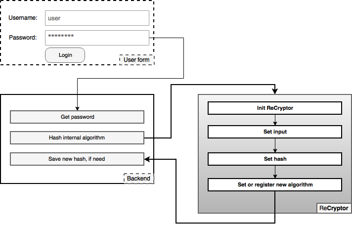

<p align="center">

</p>

[](https://travis-ci.org/filipsedivy/ReCryptor) [](https://packagist.org/packages/filipsedivy/recryptor) [](https://packagist.org/packages/filipsedivy/recryptor) [](https://packagist.org/packages/filipsedivy/recryptor)

Introduction
------------

ReCryptor can quickly and safely change your encryption algorithm.

ReCryptor is good for you if you use an outdated encryption algorithm and you need to change to a new one without a system failure and so users do not know anything.

Installation
------------

The recommended way to install is via Composer:

```
composer require filipsedivy/recryptor
```

It needed a minimum version of PHP 5.6.

Usage
-----

### Recrypt password

```php
<?php
require_once __DIR__ . '/vendor/autoload.php';

$recryptor = new ReCryptor();
$recryptor->setInput('MyPassword');
$recryptor->setHash('daa1f31819ed4928fd00e986e6bda6dab6b177dcbool');
$result = $recryptor->recrypt('SHA1');

if($result->needRehash())
{
    // Need save new hash
    $hash = $result->getHash();
}
else
{
    // Not need change hash
}
```


### List all available algorithms

```php
<?php
require_once __DIR__.'/vendor/autoload.php';
$recryptor = new ReCryptor();
print_r($recryptor->getAlgorithms());
```

Object of the algorithm
=======================

It is also possible to use hash classes. Using them, you can encrypt the input or have the hash validated. Each class inherits the object `ReCryptor\Abstraction\Algorithm`.
### Base usage

```php
<?php
require_once __DIR__.'/vendor/autoload.php';
use ReCryptor\Algorithm\SHA512;
$sha512 = new SHA512();
$sha512->setInput('Hello world');
echo $sha512->hash();
```

### Comparison of hash

```php
<?php
require_once __DIR__.'/vendor/autoload.php'
use ReCryptor\Algorithm\SHA512;
$sha512 = new SHA512();
$sha512->setInput('Hello world');
$sha512->setHash('098f6bcd4621d373cade4e832627b4f6');
var_dump($sha512->isAlgorithm());
```

Use example diagram
===================



Donate
======
PayPal: mail@filipsedivy.cz